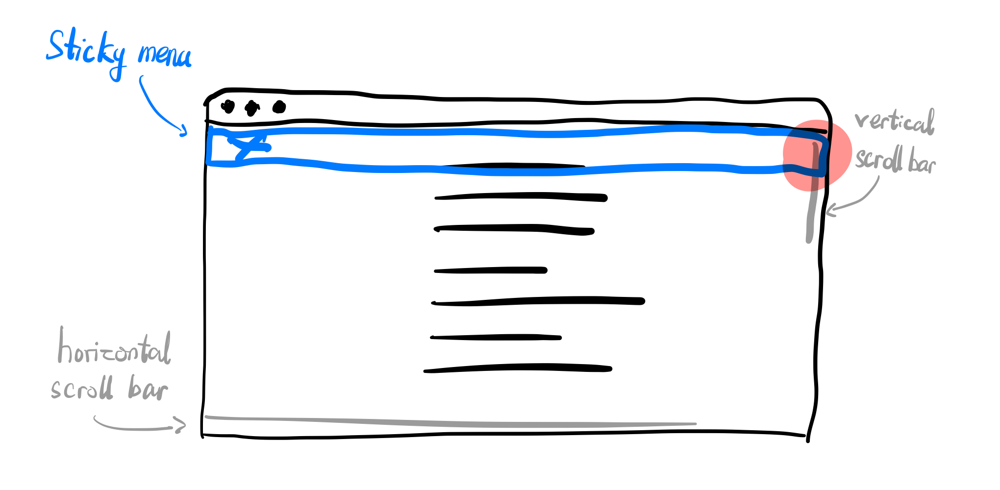
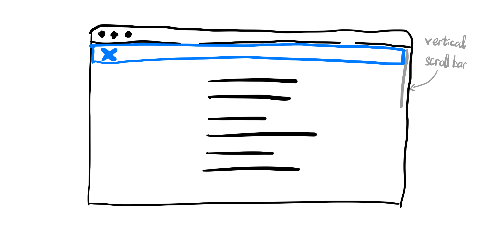

Trong bài này có nói về đơn vị view-width trong CSS và CSS Variables. Nếu vẫn còn mơ hồ về một trong hai hoặc cả hai
khái niệm trên thì mình sẽ tóm tắt ngắn gọn ở đây:

- View-width (vw) là một đơn vị do độ dài trong CSS và 1vw tương đương với 1% chiều rộng của toàn bộ viewport, bao gồm
  cả thanh scroll.
- CSS Variables (hay còn gọi là CSS custom properties) có cái tên nói lên tất cả: các thuộc tính tự tạo trong CSS.

## Vậy width:100vw thì có vấn đề gì?

Bản chất `width:100vw` thì chẳng có vấn đề gì cả, bao đời nay người ta vẫn dùng nó thôi. Nhưng "nghiệp" sẽ đến khi chúng
ta dùng `width:100vw` kết hợp với `position:fixed` hoặc `position:absolute`.

Ví dụ dưới đây khi làm một sticky menu bar dùng `position:fixed` và `width:100vw`.



Màn giao lưu này ngay lập tức sinh ra một đứa con ngoài mong muốn là horizontal scroll bar. Biết rằng ở ví dụ này, chúng
ta có một vài cách để xử lý:

- Dùng các thuộc tính top/left/right để tạo chiều dài thay vì `width:100vw`
- Dùng `width:100%` cũng có thể nếu html được sắp xếp phù hợp

Tuy nhiên trong thực tế có những trường hợp nếu không dùng `width:100vw` thì cũng không còn cách nào khả dĩ hơn. Codepen
dưới đây sẽ demo cho việc dùng `position:absolute` và `width:100vw` để làm full screen background, bạn có thể thay đổi
giá trị width của background để xem rõ vấn đề.

<iframe src="https://codepen.io/phucbui/pen/mdmWvXy"
style="width:100%; height:300px;"
> </iframe>

## Cách giải độc

Cũng từ codepen ở trên, chúng ta thấy `--my-100vw` được sử dụng để thay thế cho `100vw`. Variable `—my-100vw` được khai
báo bằng CSS như sau:

```css
:root {
    --my-100vw:100vw; /* default value */
}
```

Việc khai báo giá trị mặc định là 100vw có ý nghĩa như một fallback. Với variable này, chúng ta có 2 lựa chọn để chuyển
đổi 100vw về đúng giá trị mong muốn, đó là

> 100vw sẽ bằng 100% chiều rộng của viewport, không tính scroll bar.

### 1. Override bằng CSS

Trong CSS, để loại bỏ width của scroll bar khỏi 100vw, chúng ta sẽ trực tiếp trừ đi độ rộng này, lưu ý rằng độ rộng này
là không cố định.

```css
:root {
    --my-100vw:100vw; /* default value */
}
html.mac {
    --my-100vw:calc(100vw - 15px); /* 15px is the scroll bar size on my MAC */
}
html.windows {
    --my-100vw:calc(100vw - 17px); /* size on my Windows */
}
```

Và bạn phải sử dụng một browser detector để biết được khi nào cần override bằng giá trị nào.

### 2. Override bằng JavaScript

Khi JavaScript nhúng tay vào thì mọi chuyện trở nên nhẹ nhàng hơn. Chúng ta sẽ dùng `document.body.clientWidth` để lấy
đúng giá trị cần tìm.

```jsx
// update CSS variable
function updateCustomCSSVariable(){
    $("html").css("--my-100vw", document.body.clientWidth + "px");
}

// on window load and resize
$(window).on("load resize", updateCustomCSSVariable);
```

Và đây là kết quả mà chúng ta có được.



## Các đường dẫn có thể bạn muốn xem

- [CSS Units](https://www.w3schools.com/cssref/css_units.asp)
- [CSS Variables: Why Should You Care?](https://developers.google.com/web/updates/2016/02/css-variables-why-should-you-care)